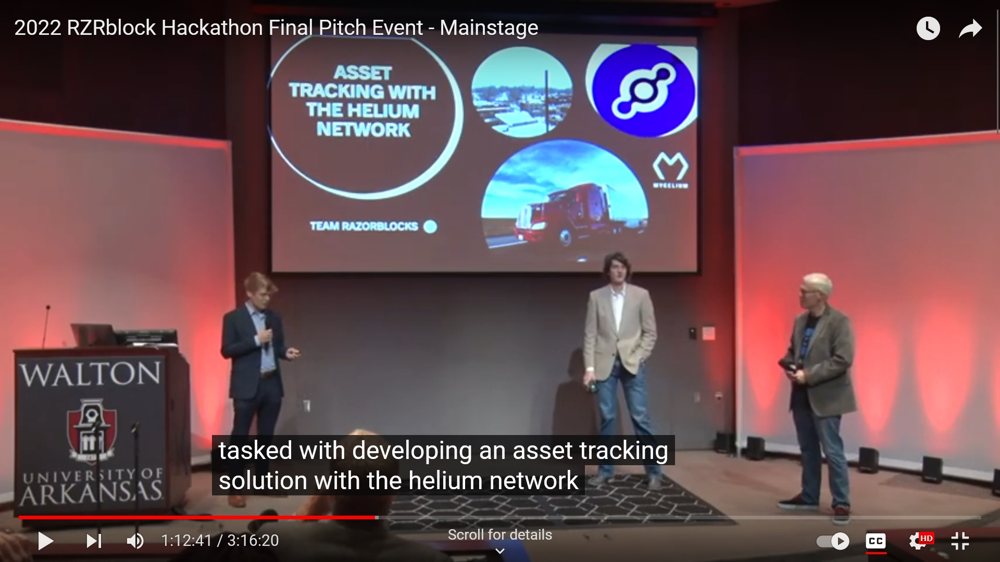
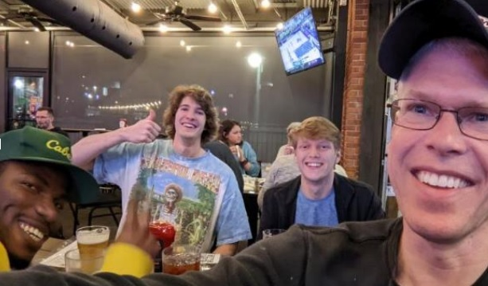

## University of Arkansas Walton College of Business
## Blockchain Hackathon 2022

### Team:  RazorBlocks

#### Overview:

The University of Arkansas Walton College of Business sponsors an annual Blockchain Hackathon.  Team RazorBlocks participated in the 2022 Hackathon.   The team was tasked in developing an asset tracking solution using the Helium network.  Team members included:  Adrian Ahlbrandt (Team Captain), Wesley Bailiff, and Stephen Witty.

A video of the final presentation can be found here:

https://www.youtube.com/live/nNTCnQ0CxLc?feature=share&t=4335

Many thanks to Mycelium Networks for not only sponsoring the Hackathon use case, but also providing aid and technical support to the team.

 &nbsp; &nbsp;  &nbsp; &nbsp; &nbsp; &nbsp; &nbsp; &nbsp; &nbsp; &nbsp;

The slide presentation and project source code can be found in this repository.  Project source code should be considered POC only.

For questions or comments:  Stephen Witty switty@level500.com
